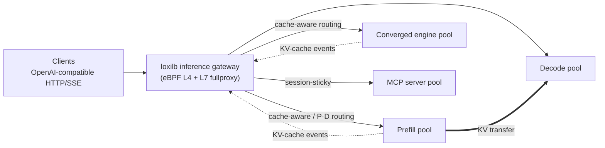

[](https://www.loxilb.io) [](https://ebpf.io/projects#loxilb)      
 [![Info][docs-shield]][docs-url] [](https://www.loxilb.io/members)

# loxilb-inference-gateway

An **inference-aware L4/L7 load balancer for LLM serving fleets**. It is a fork of
[loxilb](https://github.com/loxilb-io/loxilb) that keeps the same GoLang/eBPF data path and
adds routing that understands how vLLM, SGLang, TensorRT-LLM and llama.cpp actually serve
requests: KV-cache locality, prefill/decode phases and streaming responses.

Every AI capability is opt-in per load-balancer rule. With none enabled, the gateway behaves
exactly like upstream loxilb, so one gateway can carry both classic cloud-native traffic and
inference traffic.

📖 **Documentation: <https://loxilb-io.github.io/loxilbdocs-inference-gateway/latest/>**



## Key capabilities

| Capability | What it does | Guide |
|---|---|---|
| KV-cache-aware routing | Sends each request to the endpoint whose KV cache already holds the longest prefix of the prompt, by prefix-hash affinity or by the engine's own cache events | [KV-cache routing][kv] |
| Prefill/Decode disaggregation | Splits each request across prefill and decode pools, with KV-transfer coordination and session affinity | [P/D disaggregation][pd] |
| Model-name routing | Routes by the requested model to per-model endpoint pools | [Model load balancing][model-lb] |
| SSE streaming | Stream-aware proxying with idle-timeout suppression and a runaway cap | [SSE & quota][sse] |
| AI traffic governance | API keys, JWT, model authorization and request/token quotas, enforced before dispatch | [AI traffic governance][gov] |
| MCP gateway | Session-sticky proxying of Model Context Protocol server pools | [MCP gateway][mcp-gw] |
| Observability | Prometheus metrics and provisioned Grafana dashboards for L4, L7 and AI traffic | [Monitoring][mon] |
| Classic load balancing | Everything upstream loxilb does: L4/NAT, Kubernetes service LB, SCTP/telco, HA | [upstream docs][upstream-docs] |

Engine support differs per feature. Check the [engine capability matrix][matrix] and
[choose your engine][choose] before designing a deployment.

## Quick start

Run the gateway on a Linux host with Docker. Use a release tag you have tested; `:latest` is
for throwaway evaluation only.

```bash
docker run -u root --cap-add SYS_ADMIN --restart unless-stopped --privileged \
  -dit --net=host -v /dev/log:/dev/log -v /opt/loxilb/config:/etc/loxilb \
  --name loxilb ghcr.io/loxilb-io/loxilb-inference-gateway:<RELEASE_TAG>
```

- **Mount `/etc/loxilb` from the host.** The gateway stores its configuration snapshot there
  and restores it at boot; without the mount, configuration is lost when the container is
  recreated.
- **Allow at least 2 GiB of memory** if you set a container memory limit.

Then create a rule through the REST API on port `11111`. This one is **engine-exact
KV-cache-aware routing**: the gateway subscribes to each vLLM replica's KV-cache event
stream, tokenizes every prompt itself, and sends the request to the replica that already
holds the longest cached prefix.

```bash
curl -s -X POST http://127.0.0.1:11111/netlox/v1/config/loadbalancer \
  -H 'Content-Type: application/json' -d '{
  "serviceArguments": {
    "externalIP": "192.0.2.20", "port": 8080, "protocol": "tcp",
    "sel": 0, "mode": 4, "host": "192.0.2.20", "sse_mode": true,
    "kvExactMode": 3, "kvEngineType": "vllm", "kvZmqPort": 5557, "kvBlockSize": 16 },
  "endpoints": [
    { "endpointIP": "198.51.100.11", "targetPort": 8000, "weight": 1 },
    { "endpointIP": "198.51.100.12", "targetPort": 8000, "weight": 1 },
    { "endpointIP": "198.51.100.13", "targetPort": 8000, "weight": 1 } ]}'
```

| Field | Meaning |
|---|---|
| `mode: 4` | L7 fullproxy, required for every AI feature |
| `kvExactMode: 3` | Engine-exact routing over a single pool (`1` is the prefill/decode topology) |
| `kvEngineType` | Which engine's cache contract to follow: `vllm` or `sglang` |
| `kvZmqPort`, `kvBlockSize` | Must match the engine's event port and `--block-size` |
| `sse_mode` | Stream-aware proxying for token streams |

Each vLLM replica publishes its cache events:

```bash
PYTHONHASHSEED=0 vllm serve <MODEL> --port 8000 --block-size 16 \
  --prefix-caching-hash-algo sha256_cbor \
  --kv-events-config '{"enable_kv_cache_events":true,"publisher":"zmq","endpoint":"tcp://*:5557"}'
```

The gateway also needs the model's `tokenizer.json` staged under `/etc/loxilb/tokenizers/`;
without it the rule silently falls back to load-based routing. The addresses above are
placeholders. See [KV-cache routing][kv] for tokenizer staging and the zero-engine-change
alternative (prefix-hash affinity, `sel: 8`), [P/D disaggregation][pd] for split
prefill/decode pools, and the [Quickstart][quickstart] for the full path from readiness to
cleanup.

## Documentation

| I want to… | Start here |
|---|---|
| Install and run a first rule | [Installation][install] · [Quickstart][quickstart] |
| Understand the design | [Architecture][arch] · [Running modes][modes] · [AI routing model][routing-model] |
| Pick an engine and topology | [Choose your engine][choose] · [Engine capability matrix][matrix] |
| Integrate an engine | [vLLM][vllm] · [SGLang][sglang] · [TensorRT-LLM][trtllm] · [llama.cpp][llamacpp] |
| Route by cache locality or split prefill/decode | [KV-cache routing][kv] · [P/D disaggregation][pd] · [Configuration & tuning][tuning] |
| Run a multi-tenant endpoint | [AI traffic governance][gov] · [API key management][apikey] · [SSE & quota][sse] |
| Secure the gateway | [mTLS][mtls] · [Data-plane JWT][jwt] · [Management API authentication][mgmt-auth] |
| Operate it | [Monitoring][mon] · [Backup & restore][backup] · [Audit log][audit] · [Troubleshooting][trouble] |
| Look something up | [REST API][api] · [CLI][cli] · [Configuration][config] · [Metrics][metrics] · [System requirements][sysreq] |

Also in this repository:

- [`docs/BUILD.md`](docs/BUILD.md) — build the gateway and its images from source
- [`mcp/`](mcp/README.md) — `loxilb-mcp`, a bridge that lets an MCP client operate the gateway
- [`deploy/monitoring/`](deploy/monitoring/README.md) — the Prometheus and Grafana stack
- [`cicd/`](cicd/) — runnable scenarios for every feature; most need no GPU

## Where it fits

One Go/eBPF binary covers L4 through inference-aware L7, with no Envoy, sidecar chain or
mandatory Kubernetes control plane. It is not a multi-provider API proxy (it load-balances
your own engines) and not an orchestrator (it does not schedule or scale engine pods). If you
only need the base cloud-native load balancer, use
[upstream loxilb](https://github.com/loxilb-io/loxilb) directly.

## Community

Questions, issues and pull requests for the inference gateway are welcome in this repository;
see [CONTRIBUTING.md](CONTRIBUTING.md) and [SECURITY.md](SECURITY.md). To chat with
developers and other users, join the loxilb [Slack](https://www.loxilb.io/members). For core
loxilb questions, use the upstream
[discussions](https://github.com/loxilb-io/loxilb/discussions).

## CICD Workflow Status

### AI-Inference gateway

| AI & L7 feature sanity | Build & Release |
|:-------------|:-------------|
| [](https://github.com/loxilb-io/loxilb-inference-gateway/actions/workflows/ai-gateway-sanity.yml) — KV-cache routing, P/D, SGLang, model routing, SSE quota, API keys | [](https://github.com/loxilb-io/loxilb-inference-gateway/actions/workflows/docker-image.yml) |
| [](https://github.com/loxilb-io/loxilb-inference-gateway/actions/workflows/mcp-sanity.yml) — MCP proxying (HTTP / TLS / e2e-HTTPS, session stickiness) | [](https://github.com/loxilb-io/loxilb-inference-gateway/actions/workflows/build-check.yml) |
| [](https://github.com/loxilb-io/loxilb-inference-gateway/actions/workflows/l7-proxy-sanity.yml) — h1/h2, HTTPS, mTLS, prefix routing, gRPC | [](https://github.com/loxilb-io/loxilb-inference-gateway/actions/workflows/docker-multiarch.yml) |
| [](https://github.com/loxilb-io/loxilb-inference-gateway/actions/workflows/vllm-proxy-sanity.yml) — real CPU-vLLM backends (weekly) | [](https://github.com/loxilb-io/loxilb-inference-gateway/actions/workflows/release.yml) |

### Classic LB sanity (inherited from loxilb)

| Features(Ubuntu20.04) | Features(Ubuntu22.04)| Features(Ubuntu24.04)|
|:----------|:-------------|:-------------|
| [](https://github.com/loxilb-io/loxilb-inference-gateway/actions/workflows/basic-sanity.yml)  | [](https://github.com/loxilb-io/loxilb-inference-gateway/actions/workflows/basic-sanity-ubuntu-22.yml) | [](https://github.com/loxilb-io/loxilb-inference-gateway/actions/workflows/basic-sanity-ubuntu-24.yml) |
| [](https://github.com/loxilb-io/loxilb-inference-gateway/actions/workflows/tcp-sanity.yml) | [](https://github.com/loxilb-io/loxilb-inference-gateway/actions/workflows/tcp-sanity-ubuntu-22.yml)   | [](https://github.com/loxilb-io/loxilb-inference-gateway/actions/workflows/tcp-sanity-ubuntu-24.yml)   |
| [](https://github.com/loxilb-io/loxilb-inference-gateway/actions/workflows/udp-sanity.yml) | [](https://github.com/loxilb-io/loxilb-inference-gateway/actions/workflows/udp-sanity-ubuntu-22.yml) | [](https://github.com/loxilb-io/loxilb-inference-gateway/actions/workflows/udp-sanity-ubuntu-24.yml) |
| [](https://github.com/loxilb-io/loxilb-inference-gateway/actions/workflows/sctp-sanity.yml)  | [](https://github.com/loxilb-io/loxilb-inference-gateway/actions/workflows/sctp-sanity-ubuntu-22.yml)  | [](https://github.com/loxilb-io/loxilb-inference-gateway/actions/workflows/sctp-sanity-ubuntu-24.yml) |
|  [](https://github.com/loxilb-io/loxilb-inference-gateway/actions/workflows/advanced-lb-sanity.yml)|  [](https://github.com/loxilb-io/loxilb-inference-gateway/actions/workflows/advanced-lb-sanity-ubuntu-22.yml) |  [](https://github.com/loxilb-io/loxilb-inference-gateway/actions/workflows/advanced-lb-sanity-ubuntu-24.yml) |
| [](https://github.com/loxilb-io/loxilb-inference-gateway/actions/workflows/nat66-sanity.yml)   | [](https://github.com/loxilb-io/loxilb-inference-gateway/actions/workflows/nat66-sanity-ubuntu-22.yml)  |  [](https://github.com/loxilb-io/loxilb-inference-gateway/actions/workflows/nat66-sanity-ubuntu-24.yml)  |
|  [](https://github.com/loxilb-io/loxilb-inference-gateway/actions/workflows/ipsec-sanity.yml)   | [](https://github.com/loxilb-io/loxilb-inference-gateway/actions/workflows/ipsec-sanity-ubuntu-22.yml)  |  [](https://github.com/loxilb-io/loxilb-inference-gateway/actions/workflows/ipsec-sanity-ubuntu-24.yml)  |
| [](https://github.com/loxilb-io/loxilb-inference-gateway/actions/workflows/liveness-sanity.yml)  | [](https://github.com/loxilb-io/loxilb-inference-gateway/actions/workflows/liveness-sanity-ubuntu-22.yml)  |  [](https://github.com/loxilb-io/loxilb-inference-gateway/actions/workflows/liveness-sanity-ubuntu-24.yml)   |
|  | [](https://github.com/loxilb-io/loxilb-inference-gateway/actions/workflows/scale-sanity-ubuntu-22.yml) |  [](https://github.com/loxilb-io/loxilb-inference-gateway/actions/workflows/scale-sanity-ubuntu-24.yml)  |
|[](https://github.com/loxilb-io/loxilb-inference-gateway/actions/workflows/perf.yml) | [](https://github.com/loxilb-io/loxilb-inference-gateway/actions/workflows/perf.yml) |[](https://github.com/loxilb-io/loxilb-inference-gateway/actions/workflows/perf.yml) |


## License

loxilb-inference-gateway is licensed under the [Apache License 2.0](LICENSE), the same as
upstream loxilb.

[docs-shield]: https://img.shields.io/badge/info-docs-blue
[docs-url]: https://loxilb-io.github.io/loxilbdocs-inference-gateway/latest/
[upstream-docs]: https://loxilb-io.github.io/loxilbdocs/
[install]: https://loxilb-io.github.io/loxilbdocs-inference-gateway/latest/getting-started/installation/
[quickstart]: https://loxilb-io.github.io/loxilbdocs-inference-gateway/latest/getting-started/quickstart/
[choose]: https://loxilb-io.github.io/loxilbdocs-inference-gateway/latest/getting-started/choose-your-engine/
[arch]: https://loxilb-io.github.io/loxilbdocs-inference-gateway/latest/concepts/architecture/
[modes]: https://loxilb-io.github.io/loxilbdocs-inference-gateway/latest/concepts/running-modes/
[routing-model]: https://loxilb-io.github.io/loxilbdocs-inference-gateway/latest/concepts/ai-routing-model/
[matrix]: https://loxilb-io.github.io/loxilbdocs-inference-gateway/latest/concepts/engine-capability-matrix/
[vllm]: https://loxilb-io.github.io/loxilbdocs-inference-gateway/latest/ai-gateway/vllm-integration/
[sglang]: https://loxilb-io.github.io/loxilbdocs-inference-gateway/latest/use-cases/sglang-routing/
[trtllm]: https://loxilb-io.github.io/loxilbdocs-inference-gateway/latest/ai-gateway/tensorrt-llm-integration/
[llamacpp]: https://loxilb-io.github.io/loxilbdocs-inference-gateway/latest/ai-gateway/llamacpp-integration/
[kv]: https://loxilb-io.github.io/loxilbdocs-inference-gateway/latest/ai-gateway/kv-caching/
[pd]: https://loxilb-io.github.io/loxilbdocs-inference-gateway/latest/ai-gateway/pd-disaggregation/
[tuning]: https://loxilb-io.github.io/loxilbdocs-inference-gateway/latest/use-cases/configuration-tuning/
[model-lb]: https://loxilb-io.github.io/loxilbdocs-inference-gateway/latest/ai-gateway/model-load-balancing/
[sse]: https://loxilb-io.github.io/loxilbdocs-inference-gateway/latest/ai-gateway/sse-quota-management/
[gov]: https://loxilb-io.github.io/loxilbdocs-inference-gateway/latest/ai-gateway/ai-traffic-governance/
[apikey]: https://loxilb-io.github.io/loxilbdocs-inference-gateway/latest/ai-gateway/api-key-management/
[mcp-gw]: https://loxilb-io.github.io/loxilbdocs-inference-gateway/latest/ai-gateway/mcp-gateway/
[mtls]: https://loxilb-io.github.io/loxilbdocs-inference-gateway/latest/security/mtls/
[jwt]: https://loxilb-io.github.io/loxilbdocs-inference-gateway/latest/security/data-plane-jwt-auth/
[mgmt-auth]: https://loxilb-io.github.io/loxilbdocs-inference-gateway/latest/security/management-api-authentication/
[mon]: https://loxilb-io.github.io/loxilbdocs-inference-gateway/latest/operations/monitoring/
[backup]: https://loxilb-io.github.io/loxilbdocs-inference-gateway/latest/operations/backup-restore/
[audit]: https://loxilb-io.github.io/loxilbdocs-inference-gateway/latest/operations/audit-log/
[trouble]: https://loxilb-io.github.io/loxilbdocs-inference-gateway/latest/operations/troubleshooting/
[api]: https://loxilb-io.github.io/loxilbdocs-inference-gateway/latest/reference/api/
[cli]: https://loxilb-io.github.io/loxilbdocs-inference-gateway/latest/reference/cli/
[config]: https://loxilb-io.github.io/loxilbdocs-inference-gateway/latest/reference/configuration/
[metrics]: https://loxilb-io.github.io/loxilbdocs-inference-gateway/latest/reference/metrics/
[sysreq]: https://loxilb-io.github.io/loxilbdocs-inference-gateway/latest/reference/system-requirements/
